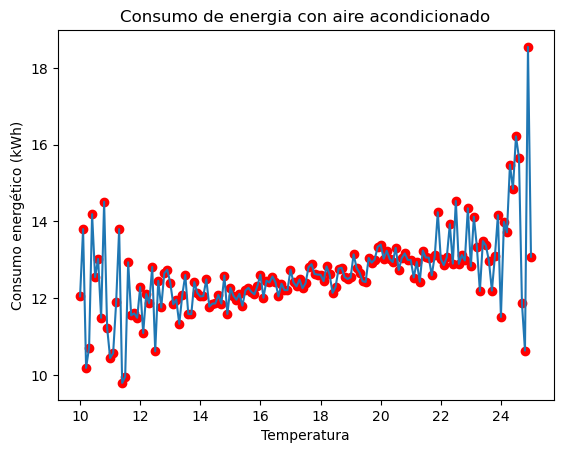
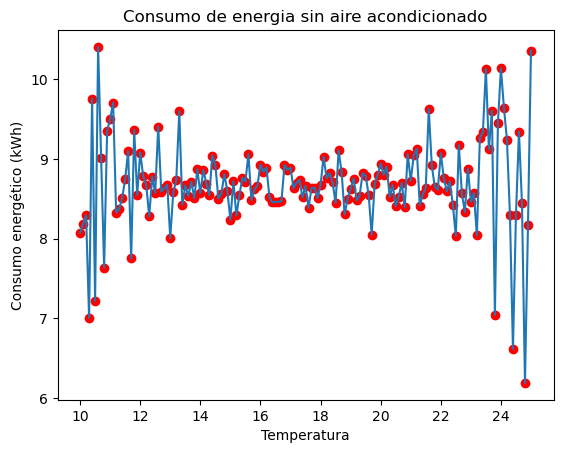
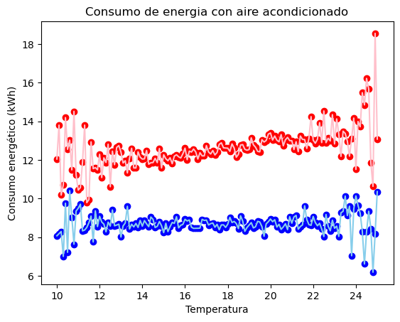

# Métodos-Numéricos-2025-b

En este repositorio se encuentran los materiales relacionados con el proyecto de Métodos Numéricos del grupo 2. 2025-B

## Proyecto

Energía – Predicción y optimización del consumo eléctrico residencial.

## Integrantes

- Miguel Angel Robles Velez
- Erik Alexander Guerrero Pillasagua
- Eduardo Alejandro Verdezoto Paredes

